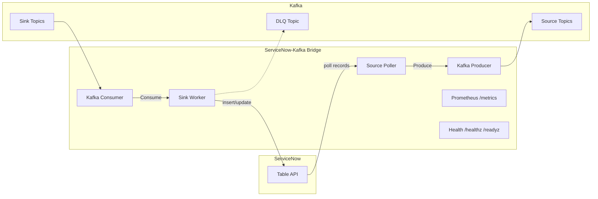

# ServiceNow-Kafka Bridge

[](https://github.com/RaikaSurendra/servicenow-kafka-bridge/actions/workflows/ci.yml)
[](https://go.dev/)
[](LICENSE)
[](https://goreportcard.com/report/github.com/RaikaSurendra/servicenow-kafka-bridge)

A high-performance, resilient Go binary for bidirectional data synchronization between ServiceNow and Kafka. This project serves as a modern replacement for the legacy IBM Kafka Connect ServiceNow connector.

## Architecture



## 🚀 Features

- **Bidirectional Pipelines**: Supports both Source (ServiceNow → Kafka) and Sink (Kafka → ServiceNow).
- **Proactive OAuth Refresh**: Background token refresh logic eliminates 401 delays.
- **At-Least-Once Delivery**: Offset updates are strictly synchronized with Kafka acknowledgments.
- **Atomic Offsets**: File-based offset storage with transactional write patterns for crash resilience.
- **Observability**: Built-in Prometheus metrics (`/metrics`) and Kubernetes-friendly probes (`/healthz`, `/readyz`).
- **Flexible Partitioning**: Default (sys_id), Round-Robin, or Hash-based strategies.

## 📋 Prerequisites

- **Go**: 1.24+ (if running natively)
- **Docker**: For containerized deployment (recommended)
- **ServiceNow**: Instance access (Base URL + OAuth/Basic credentials)
- **Kafka**: 3.x+ (KRaft mode supported)

## 🛠️ Quick Start

### 1. Configure the Bridge

Edit the provided `config.yaml` and update your credentials (OAuth/Basic, Kafka brokers, tables/topics).

### 2. Run with Docker Compose

The easiest way to start the bridge along with a Kafka broker:

```bash
docker compose up --build
```

### 3. Verify Operation

- **Health Check**: `curl http://localhost:8080/healthz`
- **Metrics**: `curl http://localhost:8080/metrics`

## 📚 Documentation

- [Getting Started](docs/getting-started.md): Step-by-step setup, configuration, and first run.
- [Architecture](docs/architecture.md): How the bridge works internally — components, data flow, error handling, and metrics.
- [Hybrid Architecture](docs/hybrid-architecture.md): Combine with ServiceNow IntegrationHub Kafka Spoke for real-time + batch.
- [Roadmap](docs/roadmap.md): What's been built and what's coming next.

## 🧪 Testing

Run the exhaustive test suite with race detection:

```bash
go test -race -v ./...
```

## 🤝 Contributing

Contributions are welcome! Please see [CONTRIBUTING.md](CONTRIBUTING.md) for guidelines.

## ⚖️ License

This project is licensed under the [Apache License 2.0](LICENSE).
