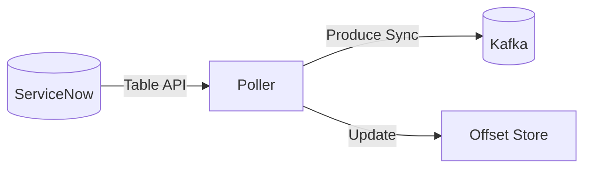
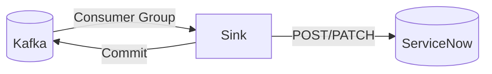

# Low-Level Design: ServiceNow-Kafka Bridge

The ServiceNow-Kafka Bridge is a high-performance Go binary designed to replace the legacy Java connector. It provides bidirectional data synchronization between ServiceNow and Kafka with a focus on durability, observability, and performance.

## 1. System Architecture

The bridge operates as a standalone service with two primary pipelines:

### 1.1 Source Pipeline (ServiceNow → Kafka)

The source pipeline periodically polls ServiceNow tables and publishes records to Kafka topics.

**Key Features:**

* **Per-Table Polling**: Each table runs in its own goroutine for isolation and parallel throughput.
* **Bounded Queries**: Implements the dual-clause query logic to ensure no records are missed during bulk updates:
  * `Clause 1: timestamp=lastTimestamp ^ id > lastID`
  * `Clause 2: timestamp > lastTimestamp ^ timestamp < throughTimestamp`
* **At-Least-Once Delivery**: Offsets are only updated in the store after Kafka acknowledges receipt (acks=all).

### 1.2 Sink Pipeline (Kafka → ServiceNow)

The sink pipeline consumes from Kafka topics and writes records back to ServiceNow.

**Key Features:**

* **Idempotent Updates**: Uses `sys_id` to determine if a record should be inserted (`POST`) or updated (`PATCH`).
* **Concurrent Workers**: Uses an `errgroup` worker pool to allow parallel writes to ServiceNow per-topic, overcoming REST API latency.
* **Dead Letter Queue (DLQ)**: Failed writes are routed to a specialized Kafka topic with error metadata, enabling non-blocking operation and later recovery.

---

## 2. Core Components

### 2.1 Authenticator (`internal/servicenow/auth.go`)

Manages ServiceNow credentials and token lifecycles.

* **Basic Auth**: Simple base64 credentials.
* **OAuth 2.0**: Implements proactive background refresh. A dedicated goroutine monitors token expiry and refreshes the token *before* it expires (at 90% of TTL), ensuring the main client never encounters a 401 delay.

### 2.2 HTTP Client (`internal/servicenow/client.go`)

A resilient wrapper around `net/http`.

* **Retry Logic**: Exponential backoff with jitter for 5xx and network errors.
* **Rate Limiting**: Integrated client-side rate limiter using `golang.org/x/time/rate`.
* **Header Handling**: Respects `Retry-After` for 429 responses.

### 2.3 Offset Store (`internal/offset/offset.go`)

Tracks synchronization progress per table.

* **FileStore**: Uses an atomic write pattern (Write-to-Temp → Rename) to prevent data corruption during crashes.
* **Sync Safety**: thread-safe access to offsets via `sync.RWMutex`.

### 2.4 Partitioner (`internal/partition/partition.go`)

Determines Kafka message keys for data distribution.

* **Default**: Uses `sys_id` as the key for per-record ordering.
* **Field-Based**: SHA-256 hashes a combination of record fields (e.g., `company + location`) to co-locate related events on the same partition.

---

## 3. Observability

The bridge exposes a Prometheus metrics endpoint on a dedicated HTTP server:

| Metric | Type | Description |
|--------|------|-------------|
| `bridge_source_records_total` | Counter | Total records fetched from ServiceNow. |
| `bridge_source_produce_total` | Counter | Records successfully sent to Kafka. |
| `bridge_sn_api_latency_seconds` | Histogram | Percentiles for ServiceNow API response times. |
| `bridge_offset_lag_seconds` | Gauge | Real-time lag between ServiceNow updates and Kafka publishing. |

---

## 4. Error Handling Strategy

| Error Scenario | Strategy |
|----------------|----------|
| **ServiceNow 401** | Force immediate token refresh and retry request. |
| **ServiceNow 429** | Enter sleep duration specified in `Retry-After` header. |
| **ServiceNow 5xx** | Exponential backoff (initial 100ms, max 30s) + jitter. |
| **Kafka Broker Unavail** | Block producer/consumer and retry with franz-go internal retries. |
| **Process Crash** | Resume from last flushed offset (at-least-once). |
| **Config Change** | `fsnotify` triggers a graceful soft-restart of all pollers/workers. |

---

## 5. Advanced Features

### 5.1 Data Governance (Avro)

The bridge integrates with the Confluent Schema Registry. It dynamically generates Avro schemas for ServiceNow tables and serializes data using the Confluent Wire Format (Wire ID + Avro payload).

### 5.2 Hot-Reload

The configuration watcher monitors `config.yaml`. On update, it cancels the active processing context, waits for components to stop, reloads the config, and restarts the bridge pipelines without restarting the container.
