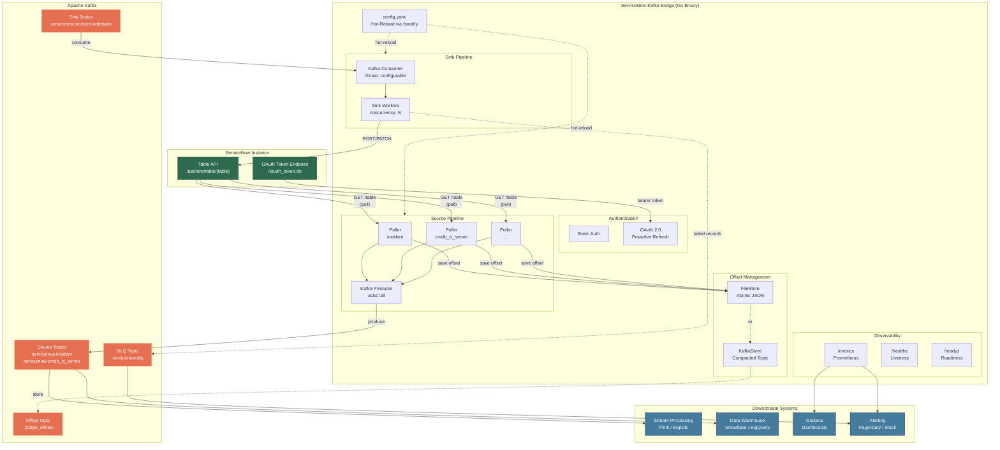
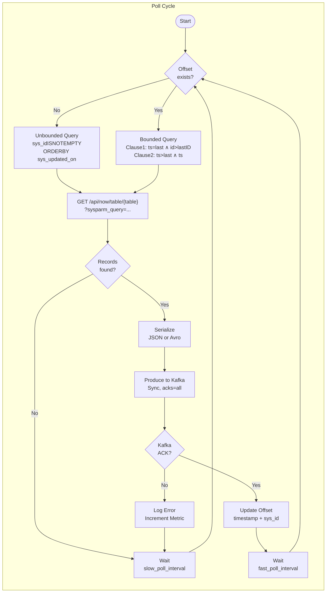
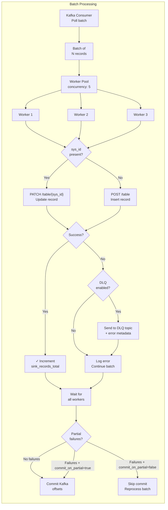
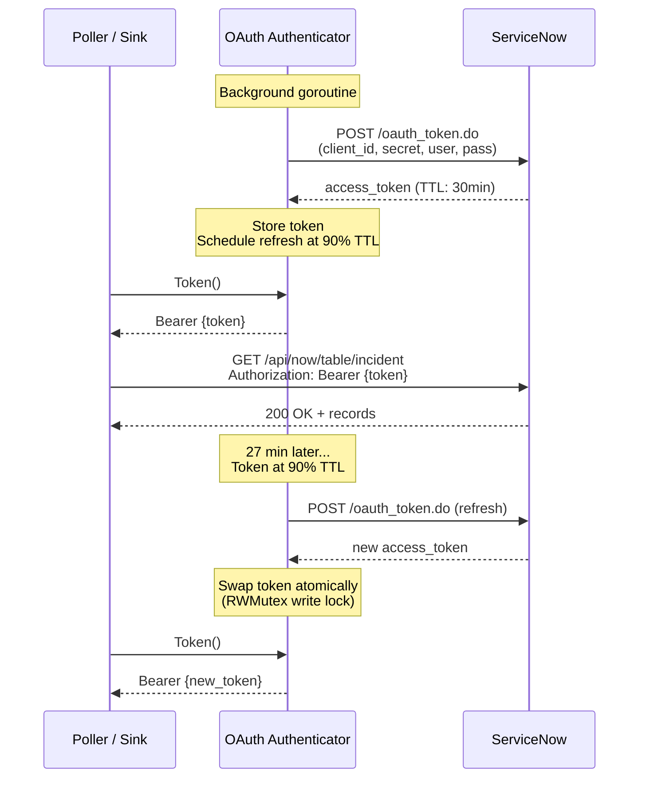
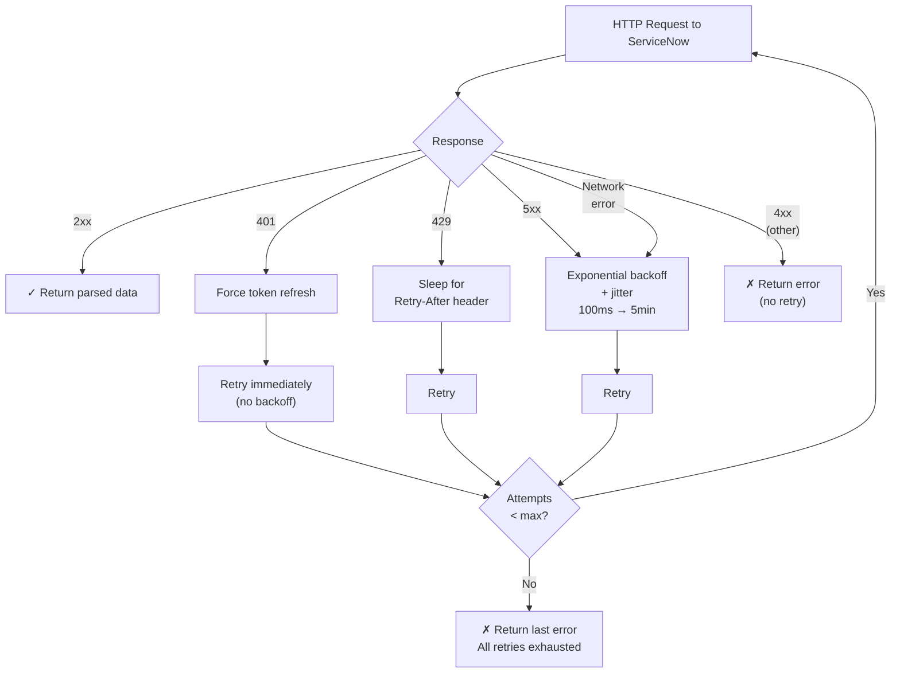
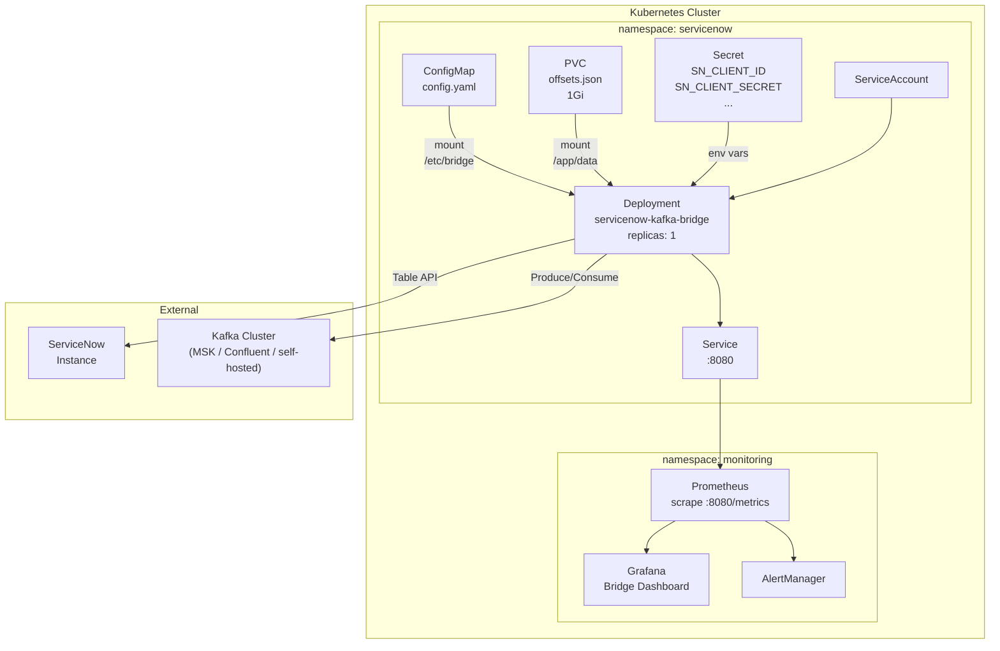
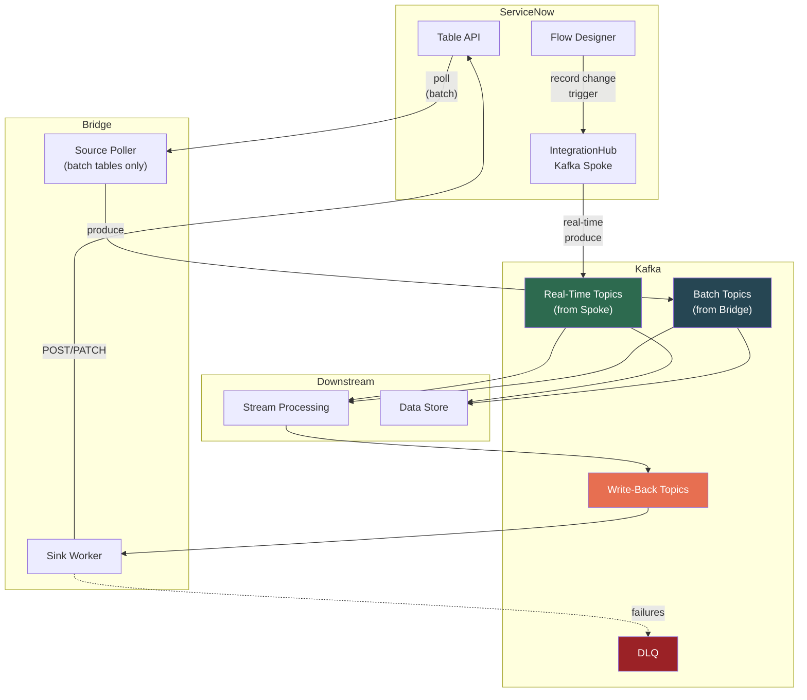

# Architecture Diagrams

Detailed Mermaid diagrams for the ServiceNow-Kafka Bridge. Use these in presentations, blog posts, or README files — they render natively on GitHub.

---

## Full System Architecture

---

## Source Pipeline Detail

---

## Sink Pipeline Detail

---

## Authentication Flow

---

## Error Handling Flow

---

## Deployment Architecture (Kubernetes)

---

## Hybrid Architecture (Bridge + IntegrationHub)

