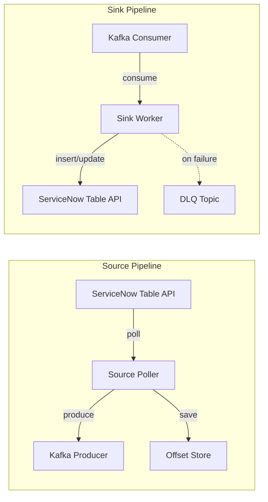

# Architecture

This document explains how the ServiceNow-Kafka Bridge works internally. It's written for developers who want to understand the design, contribute, or debug issues.

## Overview

The bridge is a single Go binary with two independent pipelines:



**Design principles:**

- **At-least-once delivery** — offsets are only saved after Kafka confirms receipt (source) or after ServiceNow confirms the write (sink).
- **Isolation** — each table gets its own poller goroutine; one slow table doesn't block others.
- **Resilience** — exponential backoff, proactive token refresh, and rate limiting handle transient failures automatically.

---

## Components

### Authenticator

**File**: `internal/servicenow/auth.go`

Manages ServiceNow credentials. Supports Basic auth and OAuth 2.0.

For OAuth, a background goroutine monitors the token's time-to-live and refreshes it at 90% of its lifespan. This means API calls never hit a 401 due to an expired token — the token is always fresh.

Thread safety is handled with `sync.RWMutex`: multiple goroutines can read the token at the same time, and only the refresh goroutine holds a write lock briefly.

### HTTP Client

**File**: `internal/servicenow/client.go`

A resilient wrapper around Go's `net/http` with:

- **Retry logic** — exponential backoff with jitter for 5xx and network errors
- **Rate limiting** — client-side rate limiter using `golang.org/x/time/rate`
- **429 handling** — respects the `Retry-After` header
- **Prometheus metrics** — tracks request count, latency, and error rates per endpoint

### Query Builder

**File**: `internal/servicenow/query.go`

Builds ServiceNow encoded queries with a fluent API:

```go
query := NewQueryBuilder().
    WhereEquals("active", "true").
    OrderByAsc("sys_updated_on").
    Build()
```

Automatically escapes special characters (like `^`) to prevent query injection.

### Source Poller

**File**: `internal/source/poller.go`

Polls a single ServiceNow table on a loop. Uses a two-clause query strategy to ensure no records are missed:

1. **Clause 1**: Records with the *same* timestamp as the last seen record but a *higher* `sys_id` (handles ties).
2. **Clause 2**: Records with a timestamp *after* the last seen record but *before* a "through" boundary (`now - delay`).

The delay prevents missing records that are being written at the exact moment of polling.

**Metrics tracked**: poll duration, records fetched, produce success/errors, offset lag.

### Sink Worker

**File**: `internal/sink/sink.go`

Consumes Kafka messages and writes them to ServiceNow:

- If the message contains a `sys_id` → **PATCH** (update existing record)
- If no `sys_id` → **POST** (create new record)

Processes batches concurrently using a worker pool (default: 5 goroutines). If a record fails:
1. The error is logged.
2. If a DLQ topic is configured, the record is forwarded there with error metadata.
3. The rest of the batch continues processing (no head-of-line blocking).

Offset commits respect the `commit_on_partial_failure` setting.

### Offset Store

**File**: `internal/offset/offset.go`

Tracks how far the bridge has synced for each table.

- **FileStore**: Writes to a temp file, then atomically renames it. This prevents corruption if the process crashes mid-write.
- **KafkaStore**: Stores offsets in a compacted Kafka topic for distributed deployments.

Thread-safe via `sync.RWMutex`.

### Partitioner

**File**: `internal/partition/partition.go`

Determines how records are distributed across Kafka partitions:

| Strategy | Key | Use Case |
|---|---|---|
| **Default** | `sys_id` | Per-record ordering |
| **Round Robin** | none | Even distribution |
| **Field-Based** | SHA-256 of chosen fields | Co-locate related records |

---

## Data Flow

### Source (ServiceNow → Kafka)

```
1. Poll     → Fetch batch of records from ServiceNow using incremental query
2. Produce  → Publish each record to Kafka (synchronous, acks=all)
3. Ack      → Wait for Kafka broker confirmation
4. Commit   → Save timestamp + sys_id to offset store
5. Repeat   → Fast interval (500ms) if records found, slow (30s) if not
```

### Sink (Kafka → ServiceNow)

```
1. Consume  → Fetch batch of messages from Kafka consumer group
2. Write    → Send POST/PATCH requests to ServiceNow (concurrent)
3. DLQ      → Route failures to dead-letter topic (if configured)
4. Commit   → Commit Kafka offsets (respects partial-failure setting)
5. Repeat
```

---

## Error Handling

| Scenario | What Happens |
|---|---|
| **ServiceNow 401** | Token is force-refreshed, request retries immediately |
| **ServiceNow 429** | Bridge sleeps for the duration in the `Retry-After` header |
| **ServiceNow 5xx** | Exponential backoff (100ms → 30s max) with random jitter |
| **Network error** | Same as 5xx — backoff and retry |
| **Kafka broker down** | franz-go retries internally; producer/consumer block until recovery |
| **Offset write fails** | Polling stops for that table to prevent data loss |
| **Process crash** | Resumes from last saved offset (at-least-once) |
| **Config file changed** | Hot-reload: gracefully restarts pipelines without killing the process |

---

## Observability

The bridge exposes Prometheus metrics on the observability HTTP server (default `:8080`):

| Metric | Type | Description |
|---|---|---|
| `bridge_source_records_total` | Counter | Records fetched from ServiceNow |
| `bridge_source_produce_total` | Counter | Records successfully sent to Kafka |
| `bridge_source_poll_duration_seconds` | Histogram | Time spent per poll cycle |
| `bridge_source_errors_total` | Counter | Source pipeline errors by type |
| `bridge_sink_records_total` | Counter | Records written to ServiceNow |
| `bridge_sink_errors_total` | Counter | Sink errors (write, DLQ, commit) |
| `bridge_sn_api_requests_total` | Counter | Total ServiceNow API calls |
| `bridge_sn_api_latency_seconds` | Histogram | ServiceNow API response times |
| `bridge_sn_api_errors_total` | Counter | API errors by status code |
| `bridge_offset_lag_seconds` | Gauge | Time lag between ServiceNow and Kafka |

Health and readiness probes:

- `GET /healthz` — returns `200` if the process is alive
- `GET /readyz` — returns `200` when all pipelines are running

---

## Advanced Features

### Avro Serialization

The bridge can serialize records as Avro instead of JSON, using the Confluent Schema Registry. It dynamically generates Avro schemas for ServiceNow tables and uses the Confluent Wire Format (magic byte + schema ID + Avro payload).

### Hot-Reload

The bridge watches `config.yaml` using `fsnotify`. When the file changes, it gracefully stops all pipelines, reloads the configuration, and restarts — without killing the process or losing the container.

### TLS / SASL

Kafka connections support:
- **TLS**: Custom CA certificates and mutual TLS (client cert + key)
- **SASL**: PLAIN, SCRAM-SHA-256, SCRAM-SHA-512
