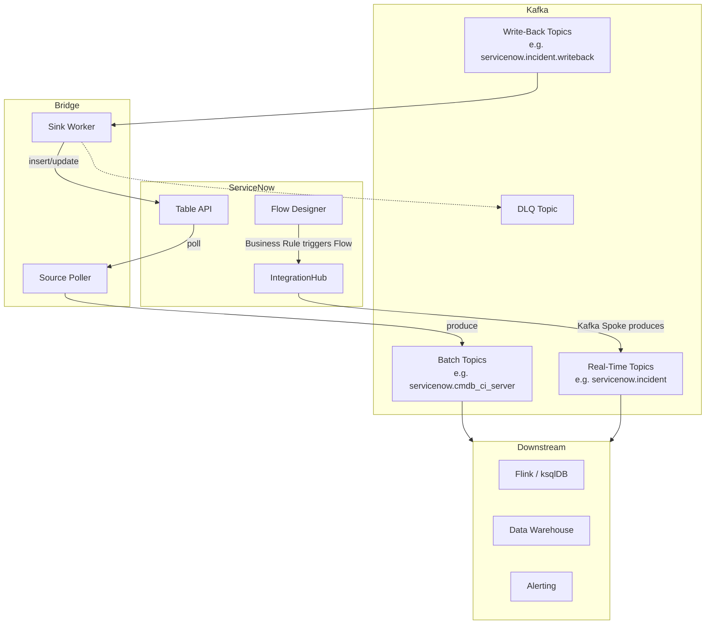

# Hybrid Architecture: Bridge + ServiceNow IntegrationHub

This guide explains how to combine the ServiceNow-Kafka Bridge with ServiceNow's native IntegrationHub Kafka Spoke for a best-of-both-worlds setup.

## Why Hybrid?

| Approach | Strengths | Limitations |
|---|---|---|
| **Bridge Source (polling)** | Works with any table, no ServiceNow config needed | Latency depends on poll interval (500ms–30s) |
| **IntegrationHub Kafka Spoke** | Real-time push, sub-second latency | Requires IntegrationHub license, per-table Flow setup |
| **Bridge Sink** | Reliable Kafka → ServiceNow writes with DLQ | N/A — this is the only write path |

**Hybrid** lets you use the Kafka Spoke for real-time events on critical tables and the Bridge for everything else.

---

## Architecture



**Data flows:**

1. **Real-time path** — ServiceNow Flow Designer triggers on record changes → IntegrationHub Kafka Spoke → Kafka topic
2. **Batch path** — Bridge Source Poller → polls ServiceNow Table API → Kafka topic
3. **Write-back path** — Kafka topic → Bridge Sink → ServiceNow Table API

---

## Setup

### Step 1: Decide Which Tables Use Which Path

| Table | Path | Reason |
|---|---|---|
| `incident` | **Kafka Spoke** (real-time) | High-priority, needs sub-second latency |
| `change_request` | **Kafka Spoke** (real-time) | Critical change tracking |
| `cmdb_ci_server` | **Bridge Source** (polling) | Bulk data, low change frequency |
| `sys_user` | **Bridge Source** (polling) | Reference data, batch is fine |
| Any write-back | **Bridge Sink** | All Kafka → ServiceNow writes |

### Step 2: Configure the Kafka Spoke in ServiceNow

1. Go to **Flow Designer** in your ServiceNow instance.
2. Create a new **Flow** triggered by a **Record** event (e.g., "Incident is created or updated").
3. Add a **Kafka Spoke** action:
   - **Bootstrap Servers**: Your Kafka broker addresses
   - **Topic**: `servicenow.incident` (match your naming convention)
   - **Key**: `${sys_id}`
   - **Value**: JSON payload with the fields you need

Example Kafka Spoke payload (configure in Flow Designer):

```json
{
  "sys_id": "${record.sys_id}",
  "number": "${record.number}",
  "short_description": "${record.short_description}",
  "state": "${record.state}",
  "sys_updated_on": "${record.sys_updated_on}"
}
```

### Step 3: Configure the Bridge

In `config.yaml`, only enable the **Bridge Source** for tables **not** covered by the Kafka Spoke:

```yaml
source:
  enabled: true
  topic_prefix: "servicenow"
  batch_size: 100
  fast_poll_interval: 500ms
  slow_poll_interval: 30s
  tables:
    # Do NOT include 'incident' or 'change_request' here —
    # those are handled by the Kafka Spoke in real-time.
    - name: "cmdb_ci_server"
      timestamp_field: "sys_updated_on"
      identifier_field: "sys_id"
    - name: "sys_user"
      timestamp_field: "sys_updated_on"
      identifier_field: "sys_id"
```

For write-back, configure the **Sink** to consume from a dedicated topic:

```yaml
sink:
  enabled: true
  group_id: "servicenow-kafka-bridge-sink"
  concurrency: 5
  dlq_topic: "servicenow.dlq"
  topics:
    - topic: "servicenow.incident.writeback"
      table: "incident"
    - topic: "servicenow.change_request.writeback"
      table: "change_request"
```

### Step 4: Topic Naming Convention

Standardize your topic names to avoid confusion:

| Topic | Producer | Consumer |
|---|---|---|
| `servicenow.incident` | Kafka Spoke | Downstream (Flink, etc.) |
| `servicenow.cmdb_ci_server` | Bridge Source | Downstream |
| `servicenow.incident.writeback` | Downstream | Bridge Sink |
| `servicenow.dlq` | Bridge Sink | Ops team (manual review) |

---

## Message Format Compatibility

The Bridge and Kafka Spoke must agree on the JSON structure. The Bridge Sink expects flat JSON:

```json
{
  "sys_id": "abc123",
  "short_description": "Server down",
  "state": "1"
}
```

**Routing rules:**

- If `sys_id` is present → the sink sends a **PATCH** (update)
- If `sys_id` is absent → the sink sends a **POST** (insert)

Configure the Kafka Spoke's payload to match this format. Avoid nested objects or ServiceNow display values — use raw field values only.

---

## Avoiding Duplicates

If both the Spoke and the Bridge Source produce events for the same table, you'll get duplicate records in Kafka.

**Rules:**

- Each table should use **exactly one** producer (Spoke OR Bridge Source, not both)
- The Bridge Sink should consume from **separate write-back topics**, not the same topics the Spoke produces to
- Use Kafka consumer groups to ensure each downstream system processes messages exactly once

---

## Monitoring the Hybrid Setup

### Bridge Metrics (Prometheus)

The bridge exposes metrics at `/metrics`:

- `bridge_source_records_total` — records polled (batch tables only)
- `bridge_sink_records_total` — records written back to ServiceNow
- `bridge_offset_lag_seconds` — how far behind the bridge is

### Kafka Spoke Metrics

Monitor via ServiceNow's **IntegrationHub Dashboard**:

- Flow execution count and success rate
- Kafka Spoke delivery status

### Recommended Alerts

| Alert | Condition | Action |
|---|---|---|
| Bridge lag > 5 minutes | `bridge_offset_lag_seconds > 300` | Check ServiceNow API rate limits |
| Sink DLQ growing | DLQ topic consumer lag > 0 | Review failed records |
| Spoke flow failures | IntegrationHub error rate > 1% | Check Kafka connectivity from ServiceNow |

---

## Example: Full Hybrid `config.yaml`

```yaml
servicenow:
  base_url: "${SN_BASE_URL}"
  auth:
    type: oauth
    oauth:
      client_id: "${SN_OAUTH_CLIENT_ID}"
      client_secret: "${SN_OAUTH_CLIENT_SECRET}"
      username: "${SN_OAUTH_USERNAME}"
      password: "${SN_OAUTH_PASSWORD}"

kafka:
  brokers:
    - "kafka-1:9092"
    - "kafka-2:9092"
  sasl:
    mechanism: SCRAM-SHA-256
    username: "${KAFKA_USERNAME}"
    password: "${KAFKA_PASSWORD}"
  tls:
    enabled: true
    ca_cert: /etc/ssl/kafka-ca.pem

# Source: only tables NOT covered by Kafka Spoke
source:
  enabled: true
  topic_prefix: "servicenow"
  batch_size: 200
  fast_poll_interval: 1s
  slow_poll_interval: 60s
  tables:
    - name: "cmdb_ci_server"
      timestamp_field: "sys_updated_on"
      identifier_field: "sys_id"
    - name: "sys_user"
      timestamp_field: "sys_updated_on"
      identifier_field: "sys_id"
    - name: "sys_user_group"
      timestamp_field: "sys_updated_on"
      identifier_field: "sys_id"

# Sink: write-back from downstream systems
sink:
  enabled: true
  group_id: "servicenow-bridge-sink"
  concurrency: 10
  commit_on_partial_failure: true
  dlq_topic: "servicenow.dlq"
  topics:
    - topic: "servicenow.incident.writeback"
      table: "incident"
    - topic: "servicenow.change_request.writeback"
      table: "change_request"

offset:
  storage: file
  file_path: /app/data/offsets.json
  flush_interval: 5s

observability:
  metrics_addr: ":8080"
```

---

## Further Reading

- [Getting Started](getting-started.md) — Run the bridge standalone
- [Architecture](architecture.md) — How the bridge works internally
- [Roadmap](roadmap.md) — Planned features including webhook-based CDC
